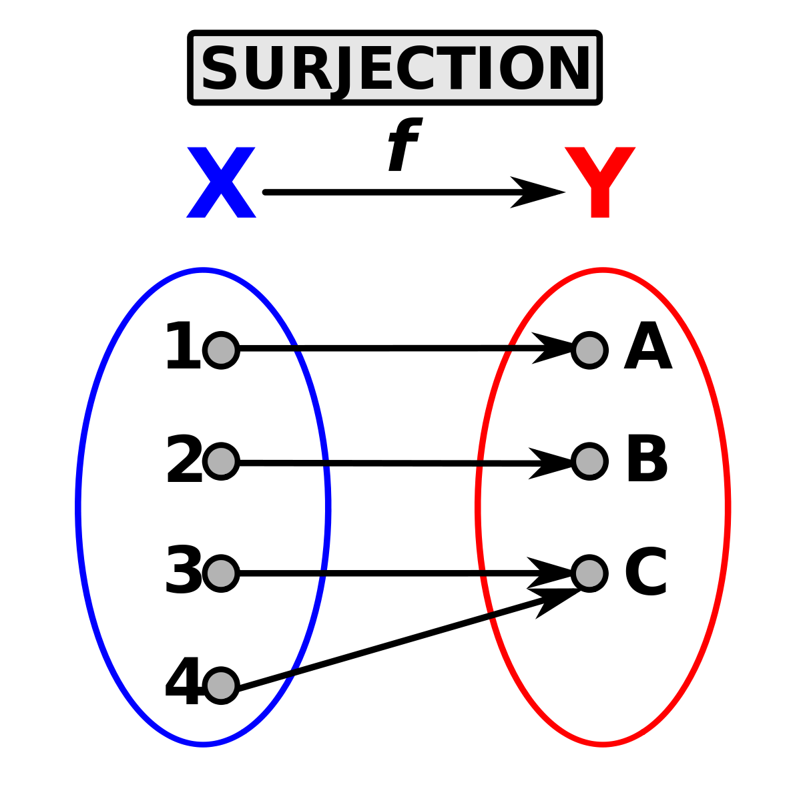

### Get started
- Pour générer un environnement virtuel:
```
 python -m venv name_env
```
- Pour activer l'environnement virtuel:
#### Sur linux
```
source name_env/bin/activate
```
#### Sur windows:
```
.\name_env\Scripts\activate
```
- Pour installer les dépendances dans l'environnement virtuel:
```
 pip install -r requirements.txt
```
- Pour lancer le script sur cette étape:
```
python main.py -i ../images/lion.jpg --speed 20 --algorithm classification --painting realistic
```
- Pour avoir des informations sur les paramètres de la ligne de commande:
```
python main.py -h
```
Il est aussi possible d'utiliser le launch.json avec le debugger vscode pour lancer les script. Les lignes de commande sont y déjà configurées.

# Etape 5 - Effets de styles !

Cette étape vise à donner un effet de style aux images via une technique assez simple : Caractériser l'image avec un nombre réduit de couleurs.
Dans une image RGB codés sur 8 bit on a 256 * 256 * 256 = 16777216 couleurs différentes, l'objectif est de limiter les nuances possibles ce qui donne un effet de peinture à l'image.

C'est donc une surjection que nous appliquons à l'image d'origine où plusieurs pixels de valeur différentes seront écrasés vers une même valeur sur l'image en sortie.




## Plusieurs méthodes possibles: 

L'exercice se déroule en deux étapes principales : 
- La première étape consiste à générer plusieurs groupes de couleurs.
- La deuxième étape consiste à appliquer la surjection : chaque pixel voit sa valeur réafecté à la valeur du groupe le plus proche.

Nous avons deux choix quand à la façon de générer les couleurs dans l'image de sortie.
- 1- On choisit nous même une palette de couleur. On peut en effet tout simplement choisir arbitrairement le nombre de groupe et le triplet de valeur rgb pour chaque groupe de couleur. On peut par exemple choisir une palette de couleur d'un thème forêt où les valeurs des groupes de couleurs tendent vers le vert. L'image de sortie aura ainsi une ambiance nature.
- 2- Laisser l'algorithme chosir les palettes.

Concernant la distance d'un pixel par rapport à un groupe on peut la calculer en additionnant les différences sur les 3 canaux RGB abs(r1-r2) + abs(g1-g2) + abs(b1-b2)

- Nous avons décidé d'explorer les deux méthodes. La première s'apparente à un problème de classification tandis que la deuxième à un problème de clustering

## Classficiation

Nous allons employer une méthode de classification des pixels en différents groupes. Une fois ces groupes établis, le but sera de déterminer la couleur approprié pour chaque pixel de l'image.

Nous lui donnons donc une palette de couleurs en amont avec les valeurs rgb ( valeurs extraites d'une palette thème forêt).

```
COLOR_PALETTE = {0: (112, 78, 46), 1: (121, 116, 46),
                 2: (194, 231, 127), 3: (230, 248, 178),
                 4: (112, 145, 118)}
```

Nous utilisons une première fonction "pixel_closest_color_from_palette" qui renvoie le triplet rgb du groupe le plus proche.
```
for i, rgb_value in enumerate(pixel_rgb):
    result += abs(rgb_value-rgb_tuple[i])
distances.append(result)
```
Cette fonction est incluse dans une autre fonction "classify_pixels" qui parcourt la matrice de pixels de l'image en remplaçant la valeur rgb de chaque pixel par celle de la palette la plus proche de la valeur initiale rgb du pixel.
```

for i, rgb in enumerate(pixel_row):
            pixel_row[i] = pixel_closest_color_from_palette(
                rgb, color_palette)
    return matrix
```
La nouvelle matrice est ensuite retournée.
Le module tqdm mesure la durée d'exécution de cette opération puisqu'il ne se passe rien graphiquement.

La fonction "draw" s'occupe ensuite d'imprimer l'image.


# Clustering

Si nous ne voulons pas choisir nous même les palettes de couleurs, nous pouvons essayer une méthode de clustering, où l'algorithme s'occupe de trouver les groupes. C'est le cas par exemple pour l'algorithme KMeans. L'un des inconvéniants de cette algorithme est que l'on doit fixer le nombre de groupe.
L'algorithme va  aléatoirement affecter des groupes au pixels. Puis, l'algorithme va calculer la distance de chaque pixel au centre de chaque groupe. Si le pixel est plus proche du centre de son groupe alors il reste , sinon il est réasigné au groupe le plus proche. On répète ces deux étapes jusqu'à ce que plus aucun pixel ne change de groupe.

```
y, x, data_size = matrix.shape
tmp = matrix.reshape((x*y,data_size))
kmeans = KMeans(n_clusters=5,random_state=0).fit(tmp)  
```

L'algorithme Kmeans de Sklearn ne prend en paramètre que des données de dimension 2 ( sample_size * data_size). Ici data_size est 3 (rgb). On restructure la matrice en concaténant les lignes succéssivement (reshape).
Vu que l'algorithme doit choisir les groupes aléatoirement durant l'initialisation on choisit au moins de lui donner une seed pour que le résultat ne change pas à chaque execution du programme (random_state = 0).
Une fois le clustering effectué on assigne à chaque pixel de l'image la valeur du centre du groupe auquel il appartient.
```
for i,value in enumerate(tmp):
    group = kmeans.labels_[i]
    val = kmeans.cluster_centers_[group]
    tmp[i] = val
tmp = tmp.reshape((y,x,data_size))
```
 On reshape encore une fois pour redonner à la matrice ses dimensions de départ.

La fonction "draw" s'occupe ensuite d'imprimer l'image.